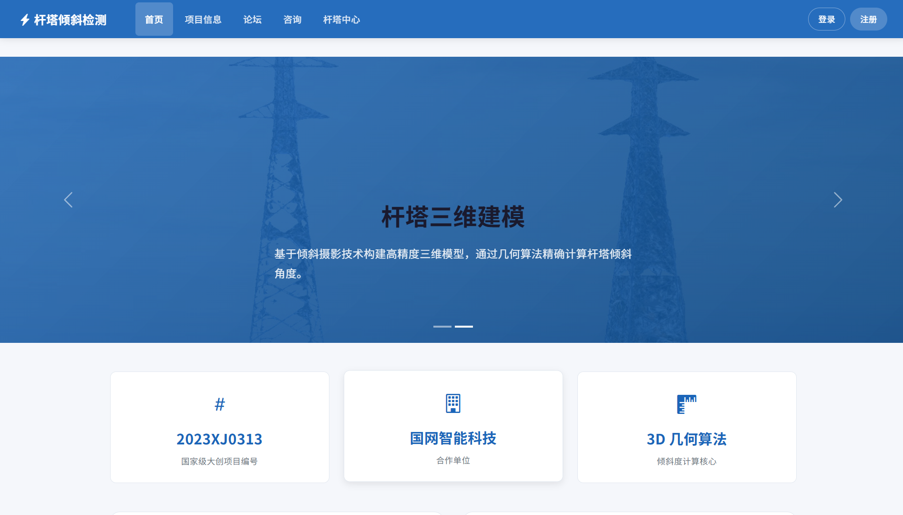
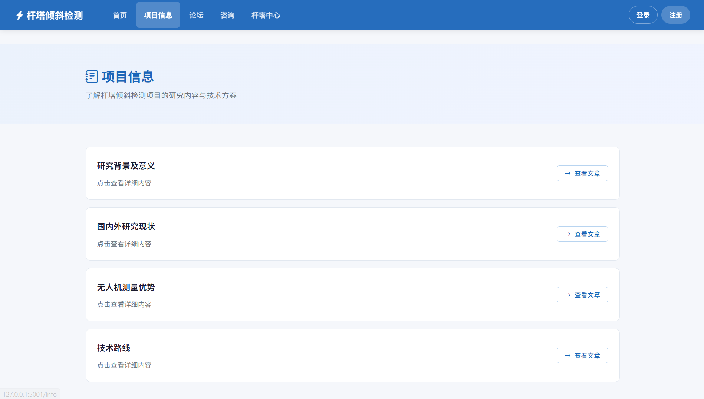
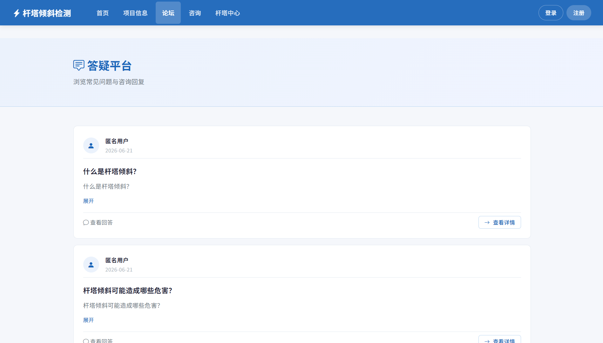
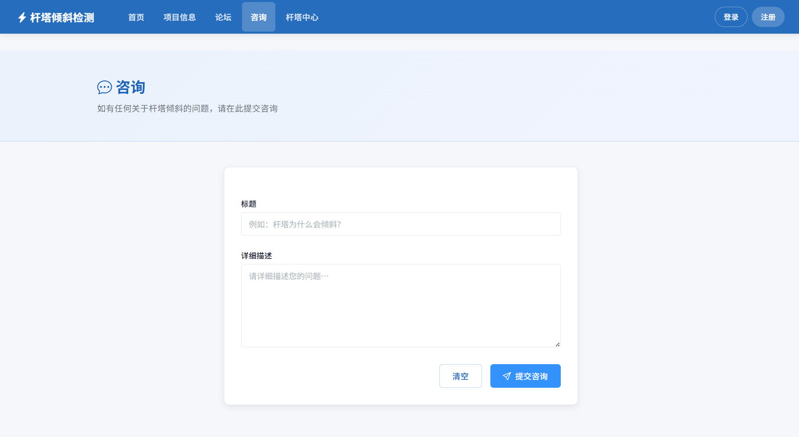
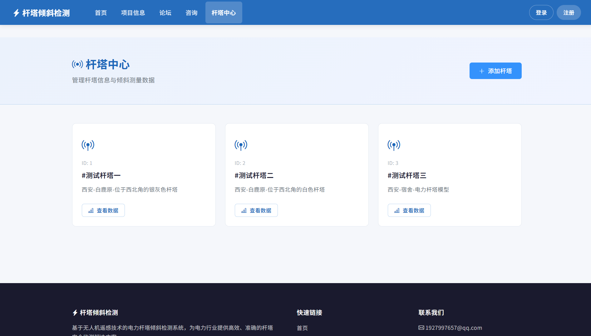
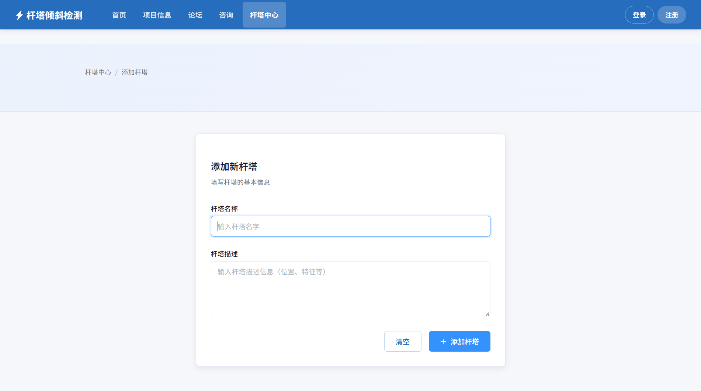
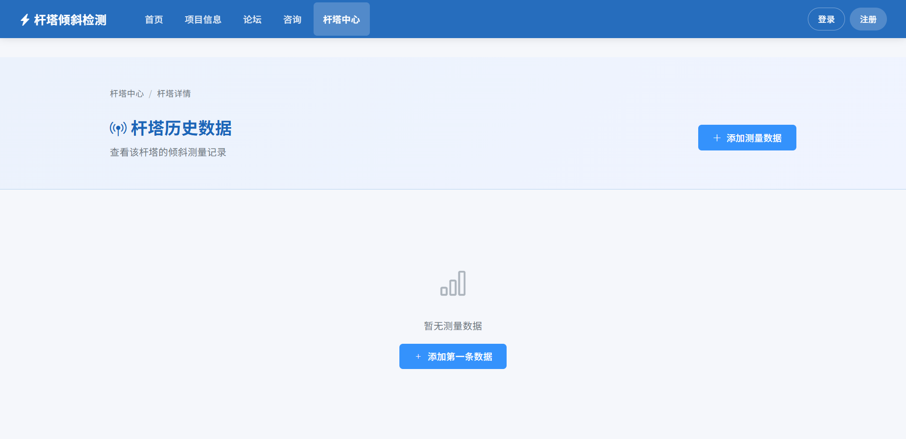

# TowerTiltDetection

国家级大创的杆塔倾斜检测的 WEB 展示项目（2023XJ0313）

## 项目简介

基于无人机遥感技术的电力杆塔倾斜检测系统，提供：
- 杆塔倾斜度 3D 几何计算算法
- 杆塔信息管理与历史数据记录
- 论坛问答与咨询功能
- 项目文章展示

## 快速启动

### 1. 创建虚拟环境并安装依赖

```shell
python -m venv env
env\Scripts\activate    # Windows
pip install -r requirements.txt
```

### 2. 配置环境变量（可选）

```shell
# 设置密钥（不设置则自动生成随机密钥）
set SECRET_KEY=your-secret-key-here
```

### 3. 初始化数据库

```shell
flask initdb --drop      # 创建数据库
flask addArticle         # 导入文章数据
flask initForum          # 初始化论坛
flask initTower          # 初始化杆塔
flask initTiltData       # 初始化杆塔测量数据
flask admin              # 创建管理员用户
```

### 4. 启动项目

```shell
python app.py
```

访问 http://localhost:5000 即可。

### 5. 打包为 exe（可选）

```shell
pyinstaller myapp.spec
```

打包后的 exe 文件在 `dist/` 目录下。

## 项目结构

```
TowerTiltDetection/
├── app.py                  # 应用入口
├── requirements.txt        # Python 依赖
├── myapp.spec              # PyInstaller 打包配置
├── appdir/
│   ├── __init__.py         # Flask 应用初始化
│   ├── config.py           # 配置类
│   ├── models.py           # 数据库模型（User, Question, Answer, Tower, TiltRecord, Article）
│   ├── routes.py           # 路由定义
│   ├── forms.py            # WTForms 表单
│   ├── commands.py         # Flask CLI 命令
│   ├── utils/
│   │   ├── util.py         # 业务逻辑工具函数
│   │   ├── dataset.py      # 种子数据
│   │   └── algorithm.py    # 杆塔倾斜度计算算法
│   ├── templates/          # Jinja2 模板
│   └── static/             # 静态资源（CSS、JS、图片）
```

## 功能模块

### 杆塔倾斜度计算

基于 3D 坐标数据（上下各 4 个测量点的经纬高），通过对角线交点法计算杆塔倾斜角度。

### 杆塔中心

- 录入杆塔信息
- 录入倾斜测量数据
- 查看历史倾斜记录

### 论坛 & 咨询

- 提交咨询问题
- 浏览论坛问答
- 查看问题详情与回答

### 项目信息

- 研究背景及意义
- 国内外研究现状
- 无人机测量优势
- 技术路线

---

## 使用指南

### 首次使用（从零开始）

```shell
# ① 克隆项目
git clone <仓库地址>
cd TowerTiltDetection

# ② 创建虚拟环境并安装依赖
python -m venv env
env\Scripts\activate          # Windows
pip install -r requirements.txt

# ③ 初始化数据库（首次必须）
flask initdb --drop           # 创建数据库表

# ④ 导入示例数据
flask addArticle              # 导入 4 篇项目文章
flask initForum               # 导入 3 条论坛示例问答
flask initTower               # 导入 3 座测试杆塔
flask initTiltData            # 导入 1 条倾斜测量记录

# ⑤ 创建管理员账号（按提示输入用户名和密码）
flask admin

# ⑥ 启动项目
python app.py
```

启动后访问 http://localhost:5000 即可看到首页。

### 日常使用（已有数据库）

数据库文件 `appdir/app.db` 会随项目保留，日常使用只需：

```shell
env\Scripts\activate          # 激活虚拟环境
python app.py                 # 启动项目
```

### 重置数据库

如果需要清空所有数据重新开始：

```shell
flask initdb --drop           # 删除旧表并重建
flask addArticle              # 重新导入示例数据
flask initForum
flask initTower
flask initTiltData
flask admin                   # 重新创建管理员
```

> ⚠️ `flask initdb --drop` 会删除所有用户、杆塔、测量记录等数据，请谨慎操作。

### 常用操作

| 操作 | 说明 |
|------|------|
| 添加杆塔 | 登录后进入「杆塔中心」→ 点击「添加杆塔」 |
| 录入倾斜数据 | 在杆塔详情页 → 点击「添加测量数据」→ 填写 8 个方向的三维坐标 |
| 提交咨询 | 进入「咨询」页面 → 填写标题和问题内容 → 提交 |
| 查看论坛 | 进入「论坛」→ 点击「查看详情」查看回答 |
| 阅读文章 | 进入「项目信息」→ 点击文章标题查看详情 |

### 坐标数据格式

录入杆塔倾斜测量数据时，每个方向的坐标格式为：

```
经度 纬度 高度
```

三个数值用**空格**分隔，例如：

```
34.1766216 109.1832573 756.617
```

需要填写 8 个方向的坐标：
- **上部测量点**：东(E)、南(S)、西(W)、北(N)
- **下部测量点**：东(E)、南(S)、西(W)、北(N)

### 常见问题
**Q: 忘记管理员密码**
A: 重新创建即可（会覆盖已有管理员）：
```shell
flask admin
```

**Q: 如何修改端口**
A: 编辑 `app.py`，将 `app.run(port=5000)` 改为其他端口号

## 页面展示

### 首页



### 项目信息



### 论坛



### 咨询



### 杆塔中心



### 添加杆塔



### 杆塔历史数据




